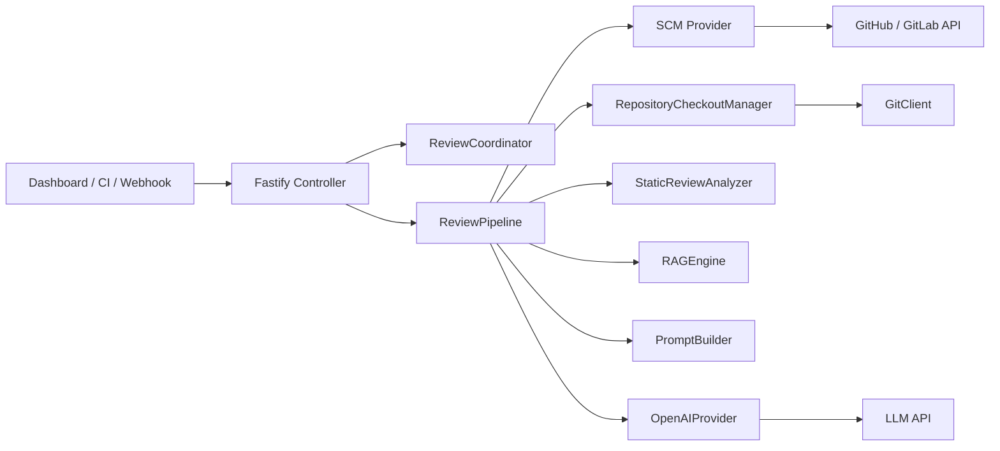

# AI Review Server

一个面向 GitHub / GitLab 的 AI 代码评审服务。

它提供一条可部署的 review 流程：读取 PR / MR diff，准备仓库 checkout，做静态分析和上下文提取，调用大模型生成评论，再把结果回写到 GitHub / GitLab。

项目当前包含：

- Fastify HTTP 服务
- GitHub / GitLab 双 SCM provider
- 多 Agent 并行评审
- 流式 NDJSON 进度输出
- 内嵌式可视化 dashboard
- PM2 部署配置

## 适用场景

- 在 CI/CD 里主动触发 AI review
- 在合并前给 PR / MR 增加自动评审
- 在 GitLab 中通过 webhook 自动调度 Merge Request review
- 需要实时看到 review 运行进度，而不是只看最终结果

## 当前能力

- 支持 `merge_request` 和 `commit` 两种 review 目标
- `/ci/review` 支持按请求切换 `github` 或 `gitlab`
- GitLab 支持 `/webhook` 自动触发 Merge Request review
- 支持同步 JSON 返回
- 支持流式 `application/x-ndjson` 返回
- 支持多 Agent 并行调用 LLM
- 支持评论回写和 commit status / check 状态更新
- 支持 mirror repo cache + `git worktree` checkout
- 支持 dashboard 查看运行进度、Agent 状态、评论结果、Token 消耗

## 架构概览



## 主要入口

- HTTP 入口: [src/controllers/review.controller.ts](./src/controllers/review.controller.ts)
- 服务启动入口: [src/entry/index.ts](./src/entry/index.ts)
- 主流程编排: [src/core/pipeline/review-pipeline.ts](./src/core/pipeline/review-pipeline.ts)
- 调度与互斥: [src/core/pipeline/review-coordinator.ts](./src/core/pipeline/review-coordinator.ts)
- Dashboard: [src/ui/dashboard.ts](./src/ui/dashboard.ts)

## 目录结构

```text
.
├── src/                        核心源码目录
│   ├── config/                 环境变量加载、默认值和配置校验
│   ├── controllers/            Fastify 路由层，处理 dashboard、/ci/review、/webhook
│   ├── core/                   review 主流程核心逻辑
│   │   ├── pipeline/           调度、互斥、主流程编排
│   │   ├── review/             checkout、diff 处理、prompt、静态分析、agent 配置
│   │   └── scale/              变更规模和风险识别
│   ├── entry/                  服务启动入口，组装 Fastify、provider、pipeline
│   ├── providers/              外部系统适配层
│   │   ├── llm/                大模型调用与结构化结果解析
│   │   └── scm/                GitHub / GitLab API 适配、diff 解析、评论回写
│   ├── rag/                    代码上下文提取和语义增强
│   │   └── extractor/          AST、结构化文件和符号提取器
│   ├── shared/                 通用工具，如 logger、errors、并发控制
│   ├── types/                  全局共享类型定义
│   └── ui/                     内嵌 dashboard 页面、样式和脚本
├── tests/                      核心模块测试
│   ├── review-pipeline.test.ts review 主流程与并发行为测试
│   ├── github-provider.test.ts GitHub provider 行为测试
│   ├── gitlab-provider.test.ts GitLab provider 行为测试
│   ├── rag-engine.test.ts      RAG 上下文提取测试
│   ├── static-review-analyzer.test.ts 静态分析测试
│   └── helpers.ts              测试辅助工具
├── ecosystem.config.cjs        PM2 进程配置
├── .env.example                环境变量示例
├── package.json                脚本、依赖和部署命令
└── tsconfig.json               TypeScript 编译配置
```

目录职责说明：

- `src/config`
  负责读取 `.env`、解析默认值，并在启动时校验关键配置是否合法。
- `src/controllers`
  对外 HTTP 入口，负责鉴权、参数解析、流式输出和 dashboard 资源返回。
- `src/core/pipeline`
  review 主干流程，包含 coordinator 互斥调度和 pipeline 执行链。
- `src/core/review`
  与单次评审直接相关的核心能力层，包括仓库 checkout、静态分析、prompt 构建、多 agent 配置等。
- `src/core/scale`
  判断变更规模和风险，给后续状态、摘要和评审策略提供信号。
- `src/entry`
  服务进程装配入口，把 provider、controller、pipeline 和 Fastify 串起来。
- `src/providers/llm`
  负责和大模型 API 通信，并把模型输出约束成项目可消费的结构化评论。
- `src/providers/scm`
  负责和 GitHub / GitLab 通信，读取 PR/MR、diff、文件内容，并回写评论和状态。
- `src/rag`
  负责从变更代码、周边文件和结构化内容中提取高价值上下文，给 prompt 提供补充信息。
- `src/shared`
  放置项目级公共能力，避免日志、异常和并发工具分散在业务模块里。
- `src/types`
  定义 review target、comment、provider 接口、progress event 等共享类型。
- `src/ui`
  内嵌式前端页面实现，包含 dashboard 的 HTML、样式和浏览器端逻辑。
- `tests`
  针对 pipeline、provider、RAG 和静态分析等主模块的自动化测试。
- `ecosystem.config.cjs`
  PM2 的启动、重载、日志和环境配置文件。

## 环境要求

- Node.js `24+`
- pnpm `10+`
- `git`

## 快速开始

### 1. 安装依赖

```bash
pnpm install
```

### 2. 准备环境变量

```bash
cp .env.example .env
```

按需填写：

- `OPENAI_API_KEY`
- `LLM_BASE_URL`
- `OPENAI_MODEL`
- `CI_REVIEW_TOKEN`
- GitHub 相关：
  - `GITHUB_TOKEN`
  - `GITHUB_API_BASE_URL`
  - `GITHUB_WEB_BASE_URL`
- GitLab 相关：
  - `GITLAB_TOKEN`
  - `GITLAB_BASE_URL`
  - `GITLAB_WEBHOOK_SECRET`

说明：

- `SCM_TYPE` 是默认平台
- `/ci/review` 可通过请求体里的 `scmType` 临时切换平台
- 如果你同时需要 GitHub 和 GitLab，建议两边 token 都配置

### 3. 启动开发模式

```bash
pnpm dev
```

### 4. 生产构建并启动

```bash
pnpm build
pnpm start
```

或：

```bash
pnpm run build:start
```

默认端口是 `9527`。

## 接入流程

### GitHub 接入流程

1. 在 GitHub 创建 Personal Access Token，并确认它能访问目标仓库

   创建步骤：

   - 打开 GitHub 右上角头像
   - 进入 `Settings`
   - 进入 `Developer settings`
   - 进入 `Personal access tokens`
   - 推荐选择 `Fine-grained tokens`
   - 点击 `Generate new token`
   - `Repository access` 选择目标仓库
   - 至少授予这些权限：
     - `Pull requests: Read and write`
     - `Contents: Read`
     - `Commit statuses: Read and write`
     - `Metadata: Read`

   创建完成后，复制 token 并保存。GitHub 只会展示一次原始值。
2. 在 `.env` 中配置：

```env
GITHUB_TOKEN=your_github_token
GITHUB_API_BASE_URL=https://api.github.com
GITHUB_WEB_BASE_URL=https://github.com
CI_REVIEW_TOKEN=your_ci_review_token
```

3. 启动服务：

```bash
pnpm run build:start
```

4. 在 dashboard 中选择 `GitHub`
5. 填写：
   - `projectPath`: `owner/repo`
   - `PR / MR 编号`: GitHub Pull Request 编号
   - `Review Token`: `CI_REVIEW_TOKEN`
6. 发起 review，或直接调用 `/ci/review`

示例：

```bash
curl -X POST 'http://localhost:9527/ci/review?stream=1' \
  -H 'Content-Type: application/json' \
  -H 'X-Review-Token: your_ci_review_token' \
  -d '{
    "scmType": "github",
    "kind": "merge_request",
    "projectPath": "owner/repo",
    "mergeRequestIid": 12
  }'
```

### GitLab 接入流程

1. 在 GitLab 或私有 GitLab 实例创建 Personal Access Token

   创建步骤：

   - 登录你的 GitLab 或私有 GitLab 实例
   - 点击右上角头像
   - 进入 `Preferences` 或 `Edit profile`
   - 进入 `Access Tokens` 或 `Personal Access Tokens`
   - 创建一个新的 token
   - 推荐直接授予 `api` 权限

   如果你们的 GitLab 实例权限拆得更细，至少要保证 token 能：

   - 读取项目
   - 读取 Merge Request
   - 读取仓库内容和 diff
   - 发布评论
   - 更新 commit status

   创建完成后，复制 token 并保存。GitLab 也通常只会展示一次原始值。
2. 在 `.env` 中配置：

```env
GITLAB_TOKEN=your_gitlab_token
GITLAB_BASE_URL=https://gitlab.com
GITLAB_WEBHOOK_SECRET=your_webhook_secret
CI_REVIEW_TOKEN=your_ci_review_token
```

如果是私有 GitLab，请把 `GITLAB_BASE_URL` 改成真实域名，例如：

```env
GITLAB_BASE_URL=https://gitlab.company.com
```

3. 启动服务：

```bash
pnpm run build:start
```

4. 在 dashboard 中选择 `GitLab`
5. 填写：
   - `projectPath`: `group/project`
   - `PR / MR 编号`: GitLab MR IID
   - `Review Token`: `CI_REVIEW_TOKEN`
6. 发起 review，或直接调用 `/ci/review`

示例：

```bash
curl -X POST 'http://localhost:9527/ci/review?stream=1' \
  -H 'Content-Type: application/json' \
  -H 'X-Review-Token: your_ci_review_token' \
  -d '{
    "scmType": "gitlab",
    "kind": "merge_request",
    "projectPath": "group/project",
    "mergeRequestIid": 265
  }'
```

### GitLab Webhook 接入流程

如果你希望在 GitLab MR 更新后自动触发 review，可以继续配置 webhook：

1. 确保 `.env` 中已配置 `GITLAB_WEBHOOK_SECRET`
2. 在 GitLab 项目设置里新增 webhook
3. 配置：
   - URL: `http://your-host:9527/webhook`
   - Secret Token: 与 `GITLAB_WEBHOOK_SECRET` 一致
   - 事件: 勾选 `Merge request events`
4. 当 MR 打开、重新打开或代码更新时，服务会自动调度 review

说明：

- `/webhook` 当前只支持 GitLab
- GitHub 自动 webhook 流程当前未实现，GitHub 请使用 dashboard 或 `/ci/review`

## Dashboard

启动后访问：

- [http://localhost:9527/](http://localhost:9527/)

页面支持：

- 选择 GitHub / GitLab
- 发起 `merge_request` review
- 开启或关闭流式输出
- 查看执行进度
- 查看 Agent 实时运行流
- 查看结果摘要、Token 消耗、评论明细和 Raw 输出

## HTTP 接口

### `GET /healthz`

健康检查。

响应：

```json
{
  "status": "ok"
}
```

### `POST /ci/review`

主动触发 review。

支持：

- 普通 JSON 返回
- NDJSON 流式返回

请求头：

```text
X-Review-Token: <CI_REVIEW_TOKEN>
```

或：

```text
Authorization: Bearer <CI_REVIEW_TOKEN>
```

#### GitHub PR 示例

```bash
curl -X POST 'http://localhost:9527/ci/review?stream=1' \
  -H 'Content-Type: application/json' \
  -H 'X-Review-Token: your-token' \
  -d '{
    "scmType": "github",
    "kind": "merge_request",
    "projectPath": "owner/repo",
    "mergeRequestIid": 12
  }'
```

#### GitLab MR 示例

```bash
curl -X POST 'http://localhost:9527/ci/review?stream=1' \
  -H 'Content-Type: application/json' \
  -H 'X-Review-Token: your-token' \
  -d '{
    "scmType": "gitlab",
    "kind": "merge_request",
    "projectPath": "group/project",
    "mergeRequestIid": 265
  }'
```

#### Commit review 示例

```bash
curl -X POST 'http://localhost:9527/ci/review' \
  -H 'Content-Type: application/json' \
  -H 'X-Review-Token: your-token' \
  -d '{
    "scmType": "github",
    "kind": "commit",
    "projectPath": "owner/repo",
    "branch": "feature/demo",
    "baseSha": "base-sha",
    "headSha": "head-sha"
  }'
```

#### 字段说明

- `scmType`: `github` 或 `gitlab`
- `kind`: `merge_request` 或 `commit`
- `projectPath`: GitHub 用 `owner/repo`，GitLab 用 `group/project`
- `mergeRequestIid`: PR / MR 编号
- `branch`: commit review 时必填
- `headSha`: commit review 时必填
- `baseSha`: commit review 时可选但建议提供

### 流式返回

带 `?stream=1` 或请求头 `Accept: application/x-ndjson` 时，接口会持续返回进度事件。

示例：

```bash
curl -N -X POST 'http://localhost:9527/ci/review?stream=1' \
  -H 'Content-Type: application/json' \
  -H 'X-Review-Token: your-token' \
  -H 'Accept: application/x-ndjson' \
  -d '{
    "scmType": "github",
    "kind": "merge_request",
    "projectPath": "owner/repo",
    "mergeRequestIid": 1
  }'
```

常见事件类型包括：

- `accepted`
- `progress`
- `heartbeat`
- `result`
- `error`

## GitLab Webhook

`/webhook` 当前只支持 GitLab。

使用前需要配置：

- `GITLAB_TOKEN`
- `GITLAB_BASE_URL`
- `GITLAB_WEBHOOK_SECRET`

在 GitLab 项目中添加 webhook：

- URL: `http://your-host:9527/webhook`
- Secret Token: 与 `GITLAB_WEBHOOK_SECRET` 一致
- 勾选 `Merge request events`

说明：

- webhook 只做接收和调度，不会同步等待整个 review 完成
- GitHub webhook 当前未实现

## 多 Agent 评审

当前默认启用 3 个 reviewer agent：

- `correctness`
- `security`
- `regression`

配置项：

```env
REVIEW_AGENT_PROFILES=correctness,security,regression
```

运行时会对同一文件分段后并行调用多个 agent，再统一汇总评论与 Token 使用量。

## 核心流程

一次 review 大致会经历：

1. 读取 PR / MR 或 commit 元数据
2. 拉取 diff
3. 过滤低价值文件
4. 判断变更规模
5. 准备 mirror repo 和 worktree
6. 执行静态分析
7. 提取 RAG 上下文
8. 按 agent 并行调用 LLM
9. 合并评论
10. 回写评论和状态

## 关键配置

来自 [.env.example](./.env.example)：

```env
NODE_ENV=development
LOG_LEVEL=info
PORT=9527

SCM_TYPE=gitlab
GITLAB_TOKEN=glpat-xxxxxxxx
GITLAB_BASE_URL=https://jihulab.com
GITLAB_WEBHOOK_SECRET=replace-with-webhook-secret

GITHUB_TOKEN=ghp_xxxxxxxx
GITHUB_API_BASE_URL=https://api.github.com
GITHUB_WEB_BASE_URL=https://github.com

CI_REVIEW_TOKEN=replace-with-ci-review-token

OPENAI_API_KEY=sk-xxxxxxxx
OPENAI_MODEL=mimo-v2-flash
LLM_BASE_URL=https://api.xiaomimimo.com/v1
REVIEW_AGENT_PROFILES=correctness,security,regression

MAX_FILE_TOKEN_BUDGET=4000
MAX_RAG_HOPS=1
REVIEW_FILE_CONCURRENCY=2
LLM_REVIEW_CONCURRENCY=2
REVIEW_FAIL_ON_COMMENTS=true
```

## PM2 部署

项目已内置 PM2 配置：

- 配置文件: [ecosystem.config.cjs](./ecosystem.config.cjs)
- 进程名: `ai-review-server`

首次部署：

```bash
pnpm install
pnpm build
pnpm pm2:start
```

更新部署：

```bash
git pull
pnpm install
pnpm deploy:pm2
```

常用命令：

```bash
pnpm pm2:start
pnpm pm2:reload
pnpm pm2:restart
pnpm pm2:stop
pnpm pm2:logs
```

PM2 日志默认输出到：

- `logs/out.log`
- `logs/error.log`

## 测试

```bash
pnpm test
```

单测文件：

```bash
pnpm test:file tests/review-pipeline.test.ts
```

类型检查测试：

```bash
pnpm test:typecheck
```

## 常见问题

### 1. 如何配置 GitHub review

推荐按下面步骤检查：

1. 在 GitHub 创建 Personal Access Token

   推荐步骤：

   - 打开 GitHub `Settings`
   - 进入 `Developer settings`
   - 进入 `Personal access tokens`
   - 选择 `Fine-grained tokens`
   - 选择需要 review 的仓库
   - 至少授予：
     - `Pull requests: Read and write`
     - `Contents: Read`
     - `Commit statuses: Read and write`
     - `Metadata: Read`
2. 确保 token 对目标仓库有访问权限
3. 在 `.env` 中配置：

```env
GITHUB_TOKEN=your_github_token
GITHUB_API_BASE_URL=https://api.github.com
GITHUB_WEB_BASE_URL=https://github.com
CI_REVIEW_TOKEN=your_ci_review_token
```

4. 调用 `/ci/review` 时传：

```json
{
  "scmType": "github",
  "kind": "merge_request",
  "projectPath": "owner/repo",
  "mergeRequestIid": 12
}
```

5. 注意：

- `projectPath` 必须是 `owner/repo`
- `mergeRequestIid` 对应 GitHub Pull Request 编号
- 如果是私有仓库，token 必须有对应仓库权限

### 2. 如何配置 GitLab review

推荐按下面步骤检查：

1. 在 GitLab 或私有 GitLab 实例创建 Personal Access Token

   推荐步骤：

   - 登录你的 GitLab 实例
   - 打开头像菜单
   - 进入 `Preferences`
   - 进入 `Access Tokens`
   - 创建新的 token
   - 优先直接授予 `api` 权限

   如果不是标准 GitLab 页面路径，按你们实例的用户设置页面找到 `Access Tokens` 即可。
2. 确保 token 有读取项目、读取 MR、读取仓库、发评论和写状态的权限
3. 在 `.env` 中配置：

```env
GITLAB_TOKEN=your_gitlab_token
GITLAB_BASE_URL=https://gitlab.com
GITLAB_WEBHOOK_SECRET=your_webhook_secret
CI_REVIEW_TOKEN=your_ci_review_token
```

如果是私有 GitLab，`GITLAB_BASE_URL` 要改成你的实例地址，例如：

```env
GITLAB_BASE_URL=https://gitlab.company.com
```

4. 调用 `/ci/review` 时传：

```json
{
  "scmType": "gitlab",
  "kind": "merge_request",
  "projectPath": "group/project",
  "mergeRequestIid": 265
}
```

5. 注意：

- `projectPath` 必须是 `group/project`
- `mergeRequestIid` 对应 GitLab MR IID，不是项目 ID
- `GITLAB_BASE_URL` 不要带 `/api/v4`
- 如果你要用 `/webhook`，还需要在 GitLab 项目里配置 webhook secret

### 3. GitHub / GitLab 401 或 404

优先检查：

- token 是否正确
- `projectPath` 是否正确
- GitHub 用的是 PR 编号，不是 issue 编号
- GitLab 用的是 MR IID，不是项目 ID
- `GITLAB_BASE_URL` 是否是正确实例地址

### 4. `fatal: not a git repository`

通常是本地 mirror cache 损坏。当前版本已经会自动检测无效 bare repo 并重建缓存。

### 5. 页面报前端错误

先执行：

```bash
pnpm build
pnpm start
```

如果还有问题，查看浏览器控制台和 `logs/error.log`。

### 6. 为什么页面里看到 `stream=1`

表示接口使用流式模式返回 NDJSON 进度事件，适合 dashboard 和命令行实时观察 review 过程。

## License

仅包含项目源码说明。实际使用时请自行遵循你所接入的 GitHub、GitLab 和模型服务的使用条款。
