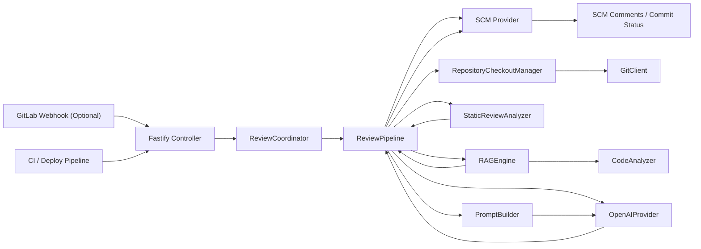
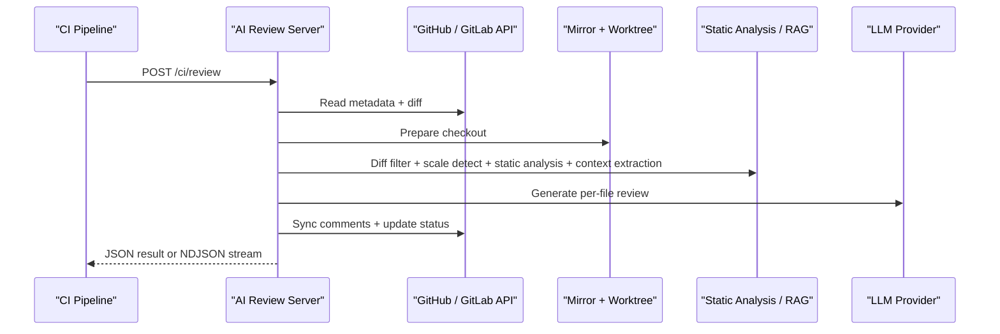
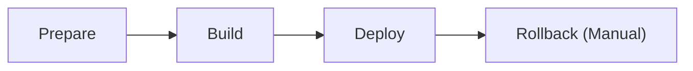

# AI Review Server

一个面向 GitHub / GitLab 场景的 AI Code Review 服务。

它可以作为独立的 HTTP Review Gate 被 CI/CD 主动调用；在 GitLab 模式下，也可以接收 Merge Request webhook 自动触发。整个服务不是把 diff 原样丢给模型，而是先经过一层确定性处理，再进入 LLM 评审链路。

> 适合这样的团队：
>
> - 希望在 Pull Request / Merge Request 更新后触发 AI review
> - 希望在部署前增加一层 review gate
> - 希望在 CI 日志里看到 review 进度，而不是只等最终结果
> - 希望把静态分析、代码上下文提取和 LLM review 收敛成一个统一服务

## 目录

- [项目定位](#项目定位)
- [核心能力](#核心能力)
- [整体架构](#整体架构)
- [请求时序](#请求时序)
- [路径架构图](#路径架构图)
- [核心执行流程](#核心执行流程)
- [快速开始](#快速开始)
- [环境变量](#环境变量)
- [HTTP 接口](#http-接口)
- [集成建议](#集成建议)
- [部署模型](#部署模型)
- [目录说明](#目录说明)
- [常见问题](#常见问题)
- [扩展方向](#扩展方向)

## 项目定位

AI Review Server 的目标不是替代现有 CI，也不是做一个“聊天式代码助手”，而是提供一条稳定、可嵌入、可追踪的 review 链路：

- 输入是 `Pull Request / Merge Request` 或 `commit`
- 中间会做 diff 过滤、规模评估、仓库 checkout、静态分析和 RAG 上下文补全
- 输出是 GitHub / GitLab 评论、commit status，以及可被 CI 消费的同步或流式结果

它特别适合需要“自动 review + 明确结果 + 可集成部署流程”的工程环境。

## 核心能力

### 接入方式

- CI/CD 通过 `POST /ci/review` 主动触发
- GitLab 模式下支持 Merge Request webhook 自动触发
- 支持同步 JSON 返回和流式 `NDJSON` 进度输出

### Review 能力

- 支持 `merge_request` review 和 `commit` review
- 支持 GitHub / GitLab 评论回写和 commit status 更新
- 支持单进程内存调度，避免同一个 MR 或同一个 CI review 目标并发重复执行
- 支持 mirror 仓库缓存与 `git worktree` 检出，降低重复拉仓库成本

### 上下文增强

- `dependency-cruiser` 检测循环依赖
- `eslint` 与 `@typescript-eslint` 提供确定性静态分析信号
- `typescript` Compiler API、`ts-morph`、`tsquery` 提取代码上下文
- 多文件契约分析会检查导出签名变更与调用方是否同步迁移

## 整体架构



## 请求时序

下面这张图展示的是 CI 主动调用 `POST /ci/review` 时的一次完整链路：



## 路径架构图

```text
.
├── src
│   ├── config                  # 环境变量加载与校验
│   ├── controllers             # HTTP 路由入口
│   ├── core
│   │   ├── pipeline            # review 主流程与任务调度
│   │   ├── review              # checkout、prompt、静态分析等核心能力
│   │   └── scale               # 变更规模识别
│   ├── entry                   # 服务启动入口
│   ├── providers
│   │   ├── llm                 # LLM provider
│   │   └── scm                 # SCM provider 与 diff 解析
│   ├── rag
│   │   └── extractor           # 代码符号和作用域提取
│   ├── shared                  # logger、errors 等通用能力
│   └── types                   # 共享类型定义
├── .gitlab
│   ├── ci                      # CI 构建脚本与 jobs
│   └── cd                      # CD 部署脚本与 jobs
├── Dockerfile                  # 应用镜像
├── Dockerfile.base             # 基础镜像
├── docker-compose.yml          # 测试/生产容器定义
└── .gitlab-ci.yml              # GitLab CI/CD 入口
```

## 核心执行流程

一次 review 的处理顺序如下：

1. 控制器接收请求，完成 token 校验；GitLab webhook 额外校验 webhook secret
2. webhook 和 `/ci/review` 都会通过 `ReviewCoordinator` 做同目标串行控制
3. `ReviewPipeline` 读取评审元数据和 diff
4. `DiffFilter` 过滤锁文件、图片、构建产物和文档等低价值文件
5. `ScaleDetector` 根据新增/删除行、删除型改动、高风险路径和变更影响信号判断规模
6. `RepositoryCheckoutManager` 用 mirror 仓库 + worktree 准备本地代码
7. `StaticReviewAnalyzer` 预留统一静态分析入口，当前保留最小实现用于承接后续扩展
8. `MultiFileContractAnalyzer` 对比基线与当前导出契约，检查调用方是否同步迁移
9. `RAGEngine` 按文件类型策略做语义分段、当前文件语义切片、调用链 / 数据流摘要、删除侧旧逻辑提取、多文件改动簇提示，以及跨文件 / 结构化配置上下文增强
10. `PromptBuilder` 生成单文件 prompt
11. `OpenAIProvider` 调用模型生成结构化评论
12. SCM provider 同步评论和 review 状态，并清理或标记旧 AI 评论

## 内部实现原理

### 调度层

- 入口在 [`src/controllers/review.controller.ts`](./src/controllers/review.controller.ts)
- GitLab webhook 调度在 [`src/core/pipeline/review-coordinator.ts`](./src/core/pipeline/review-coordinator.ts)
- `/ci/review` 的同步调用也会使用同一套 coordinator 做互斥控制
- 当前使用单进程内存调度

### 仓库准备层

- 仓库检出在 [`src/core/review/repository-checkout.ts`](./src/core/review/repository-checkout.ts)
- 底层 git 操作封装在 [`src/core/review/git-client.ts`](./src/core/review/git-client.ts)
- 当前策略是“mirror 裸仓库缓存 + 临时 worktree checkout”

这样做的原因是：

- 避免每次 review 都完整 clone 仓库
- 复用远端对象，降低拉取成本
- 对频繁 review 同一仓库的场景更友好

### 静态分析层

- 逻辑在 [`src/core/review/static-review-analyzer.ts`](./src/core/review/static-review-analyzer.ts)
- 多文件契约分析在 [`src/core/review/multi-file-contract-analyzer.ts`](./src/core/review/multi-file-contract-analyzer.ts)
- 当前接入的信号包括：
  - `dependency-cruiser`
  - `eslint`
  - `@typescript-eslint`
  - 导出签名变更与调用方迁移校验

这层的目的不是直接替代模型，而是把高置信度问题作为确定性信号喂给后续 prompt，提高 review 的稳定性。

补充说明：

- `.md` / `.mdx` / `.txt` 这类文档默认不会全量进入 review 主链，只会放行高信号路径或命中高风险示例的改动
- 如果后续业务上需要扩文档 review，建议继续按高信号白名单放开，而不是整体放开所有文档

### RAG 上下文层

- 总入口在 [`src/rag/rag-engine.ts`](./src/rag/rag-engine.ts)
- 代码上下文提取在 [`src/rag/extractor/code-analyzer.ts`](./src/rag/extractor/code-analyzer.ts)

这层主要负责：

- 从 diff 中提取高价值标识符
- 优先按语义容器切分多 hunk 文件，减少不相关改动混在同一段 prompt 中
- 找出与变更重叠的函数、类、类型和局部作用域
- 从当前文件中补充关键保护分支、调用链、一跳 / 二跳依赖和轻量数据流摘要
- 对删除型改动回看 base 版本文件，提取“被删除或被削弱的旧逻辑”上下文
- 为多文件协同修改补充改动簇摘要，提醒模型检查契约迁移是否完整
- 沿 import、邻近文件和代码搜索扩展跨文件上下文
- 为 YAML / JSON / TOML / Shell 这类非脚本文件补充结构化摘要
- 按文件策略和风险动态调整远程符号搜索、搜索深度、语义切片和旧逻辑上下文预算

changed-scope 提取采用 TypeScript AST 直读方案，直接复用 `typescript`、`ts-morph` 和 `tsquery`，避免额外 wasm grammar/runtime 带来的依赖和环境负担。

### Prompt 与模型调用

- Prompt 组装在 [`src/core/review/prompt-builder.ts`](./src/core/review/prompt-builder.ts)
- 模型访问在 [`src/providers/llm/openai.provider.ts`](./src/providers/llm/openai.provider.ts)

当前设计有两个关键点：

- prompt 不是只包含 diff，而是合并了静态信号、语义切片、调用链 / 数据流摘要、删除型旧逻辑、多文件改动簇和代码上下文
- 模型输出会被约束成 JSON，并经过 Zod 校验后再进入下游流程

### SCM 回写层

- GitHub 适配在 [`src/providers/scm/github.provider.ts`](./src/providers/scm/github.provider.ts)
- GitLab 适配在 [`src/providers/scm/gitlab.provider.ts`](./src/providers/scm/gitlab.provider.ts)

它们负责：

- 读取 PR / MR / commit 元数据
- 读取 diff 和文件内容
- 执行代码搜索
- 同步评论
- 更新 commit status

评论同步不是简单“只追加”：

- 每次回写前会先识别当前目标上的旧 AI 评论
- 纯 AI 线程会被删除
- 如果旧 AI 评论所在 discussion 已经有人类回复，则不会整条删除，而是把旧 AI note 标记为“已过期”
- 同步结果会回传“尝试发布多少、实际发布多少、删除多少、标记过期多少、失败多少”

## 快速开始

### 环境要求

- Node.js `24+`
- pnpm `10+`
- 运行环境必须可用 `git`
- 如使用 Docker，默认基于 `node:24-alpine`

### 本地开发

1. 安装依赖

```bash
pnpm install
```

如果本机没有 `pnpm`，先执行：

```bash
corepack enable
corepack prepare pnpm@10.32.1 --activate
```

2. 启动开发服务

```bash
pnpm dev
```

3. 构建产物

```bash
pnpm build
```

4. 生产方式启动

```bash
pnpm start
```

5. 运行测试

```bash
pnpm test
```

6. 运行单个测试文件

```bash
pnpm test:file tests/static-review-analyzer.test.ts
```

默认监听端口为 `3000`。

### Docker 运行

直接构建应用镜像：

```bash
docker build -t ai-code-review:local .
docker run --rm -p 3000:3000 --env-file .env ai-code-review:local
```

构建基础镜像：

```bash
docker build -f Dockerfile.base -t ai-code-review:base .
```

基础镜像只负责提供：

- `node`
- `git`
- `pnpm`

## 环境变量

### 必填项

| 变量 | 说明 |
| --- | --- |
| `SCM_TYPE` | SCM 类型，支持 `github` 和 `gitlab` |
| `CI_REVIEW_TOKEN` | `/ci/review` 接口鉴权 token |
| `OPENAI_API_KEY` | LLM 服务鉴权 token |
| `GITHUB_TOKEN` | GitHub 模式下用于读取 diff、文件内容以及回写评论和状态 |

GitLab 模式额外需要：

| 变量 | 说明 |
| --- | --- |
| `GITLAB_TOKEN` | GitLab API token |

### 常用可选项

| 变量 | 默认值 | 说明 |
| --- | --- | --- |
| `GITHUB_API_BASE_URL` | `https://api.github.com` | GitHub API 根地址 |
| `GITHUB_WEB_BASE_URL` | `https://github.com` | GitHub Web 根地址 |
| `GITLAB_BASE_URL` | `https://gitlab.com` | GitLab 模式下的根地址，JiHuLab 可改成 `https://jihulab.com` |
| `GITLAB_WEBHOOK_SECRET` | 空 | GitLab webhook 校验 secret |
| `OPENAI_MODEL` | `mimo-v2-flash` | 使用的模型名 |
| `LLM_BASE_URL` | `https://api.xiaomimimo.com/v1` | OpenAI 兼容接口地址 |
| `LLM_REVIEW_CONCURRENCY` | `2` | 发给 LLM 的实际并发数，上限会被文件并发数和待 review 文件数收敛 |
| `LLM_TIMEOUT_MS` | `30000` | 单次 LLM 请求超时时间 |
| `LLM_MAX_RETRIES` | `2` | LLM 瞬时失败时的最大重试次数，仅对超时、429、5xx 等重试 |
| `LLM_RETRY_BASE_DELAY_MS` | `1000` | LLM 重试的基础退避时间 |
| `MAX_FILE_TOKEN_BUDGET` | `4000` | 单文件上下文预算 |
| `MAX_RAG_HOPS` | `1` | 跨文件上下文最大跳数 |
| `REVIEW_FILE_CONCURRENCY` | `2` | 文件并发 review 数 |
| `REVIEW_FAIL_ON_COMMENTS` | `true` | 有评论时是否直接判失败 |

### 最小 `.env` 示例

建议先复制仓库内的 `.env.example` 为本地 `.env`，再按环境填写实际值。

```env
NODE_ENV=development
LOG_LEVEL=info

SCM_TYPE=github
GITHUB_TOKEN=github_pat_xxxxxxxx
GITHUB_API_BASE_URL=https://api.github.com
GITHUB_WEB_BASE_URL=https://github.com
CI_REVIEW_TOKEN=your-ci-review-token

OPENAI_API_KEY=sk-xxxxxxxx
OPENAI_MODEL=mimo-v2-flash
LLM_BASE_URL=https://api.xiaomimimo.com/v1

REVIEW_FILE_CONCURRENCY=2
REVIEW_FAIL_ON_COMMENTS=true
MAX_RAG_HOPS=1
```

### 基础镜像构建变量

CI 构建基础镜像时，默认还会用到这几个变量：

| 变量 | 默认值 | 说明 |
| --- | --- | --- |
| `NODE_BASE_IMAGE` | `node:24-bookworm-slim` | 基础镜像的 Node 发行版 |
| `DEBIAN_MIRROR_HOST` | `mirrors.ustc.edu.cn` | 基础镜像构建时使用的 Debian 镜像源 |
| `NPM_REGISTRY` | `https://registry.npmmirror.com` | Corepack / pnpm 下载使用的 npm registry |

## HTTP 接口

### `GET /healthz`

用于健康检查和容器探活。

```bash
curl http://localhost:3000/healthz
```

返回示例：

```json
{
  "status": "ok"
}
```

### `POST /webhook`

GitLab Merge Request webhook 入口。

注意：

- 该接口当前只在 `SCM_TYPE=gitlab` 时可用
- GitHub 模式请使用 `POST /ci/review`

请求要求：

- `X-Gitlab-Event: Merge Request Hook`
- `X-Gitlab-Token` 与 `GITLAB_WEBHOOK_SECRET` 一致

行为说明：

- 该接口只负责“调度 review”，不会同步阻塞等待整条链路执行完
- 成功时返回 `202 Accepted`
- 当前会对 `open`、`reopen`、`update` 这几类 MR action 触发调度

### `POST /ci/review`

CI 主动触发 review 的接口，也是部署前最常用的接入方式。

鉴权支持两种方式：

- `X-Review-Token: <token>`
- `Authorization: Bearer <token>`

#### 请求体字段

| 字段 | 说明 |
| --- | --- |
| `kind` | `commit` 或 `merge_request` |
| `projectPath` | SCM 项目路径，例如 `owner/repo` 或 `group/project` |
| `branch` | commit review 时必填 |
| `baseSha` | commit review 可选 |
| `headSha` | commit review 时必填 |
| `mergeRequestIid` | merge request review 时必填 |
| `author` | commit review 可选 |
| `title` | commit review 可选 |
| `description` | commit review 可选 |
| `htmlUrl` | commit review 可选 |

#### commit review 示例

```bash
curl -X POST http://localhost:3000/ci/review \
  -H "Content-Type: application/json" \
  -H "Authorization: Bearer ${CI_REVIEW_TOKEN}" \
  -d '{
    "kind": "commit",
    "projectPath": "owner/repo",
    "branch": "dev",
    "baseSha": "abc123",
    "headSha": "def456",
    "author": "alice",
    "title": "fix: handle empty result",
    "description": "deploy gate review",
    "htmlUrl": "https://github.com/owner/repo/commit/def456"
  }'
```

#### PR / merge request review 示例

```bash
curl -X POST http://localhost:3000/ci/review \
  -H "Content-Type: application/json" \
  -H "Authorization: Bearer ${CI_REVIEW_TOKEN}" \
  -d '{
    "kind": "merge_request",
    "projectPath": "owner/repo",
    "mergeRequestIid": 123
  }'
```

说明：

- GitHub 模式下，`mergeRequestIid` 对应 Pull Request 编号
- GitLab 模式下，`mergeRequestIid` 对应 Merge Request IID

### 普通模式返回语义

| HTTP 状态码 | 含义 |
| --- | --- |
| `200` | review 通过 |
| `409` | review 未通过 |
| `500` | review 执行失败，或评论同步未完成 |

返回示例：

```json
{
  "review": "!123",
  "requestId": "req-1",
  "conclusion": "failure",
  "commentCount": 2,
  "syncedCommentCount": 2,
  "deletedCommentCount": 2,
  "outdatedCommentCount": 0,
  "commentSyncFailureCount": 0,
  "reviewedFileCount": 5,
  "errorCount": 0,
  "findings": [
    "src/user/service.ts:38 **[悬空 Promise]** ...",
    "src/order/repo.ts:71 **[依赖循环]** ..."
  ],
  "message": "AI review rejected deployment"
}
```

## 流式模式

如果你希望在部署日志里实时看到 review 执行进度，可以开启流式模式。

任意一种方式都可以开启：

- Query: `?stream=1`
- Header: `X-Review-Stream: 1`
- Header: `Accept: application/x-ndjson`

示例：

```bash
curl --no-buffer -X POST "http://localhost:3000/ci/review?stream=1" \
  -H "Content-Type: application/json" \
  -H "Authorization: Bearer ${CI_REVIEW_TOKEN}" \
  -d '{
    "kind": "commit",
    "projectPath": "group/project",
    "branch": "dev",
    "headSha": "def456"
  }'
```

流式输出格式为 `NDJSON`，典型事件如下：

| 事件类型 | 说明 |
| --- | --- |
| `accepted` | 请求已受理 |
| `progress` | 某个执行阶段已推进 |
| `heartbeat` | 任务仍在运行 |
| `result` | 最终结果 |
| `error` | 执行期间发生异常 |

除了原有的 `type`、`stage`、`statusCode`、`data` 这类机器字段外，流式事件现在还会附带更适合日志展示的字段：

| 字段 | 说明 |
| --- | --- |
| `message` | 人类可读的一句话进度描述，适合直接打印到 CI 日志 |
| `emoji` | 当前阶段的视觉标识 |
| `progress.current` | 已完成文件数 |
| `progress.total` | 总文件数 |
| `progress.percent` | 当前进度百分比 |

输出示例：

```json
{"type":"accepted","requestId":"req-1","message":"🤖 已接收 AI Review 请求，目标 owner/repo（commit）","emoji":"🤖"}
{"type":"progress","requestId":"req-1","stage":"diff_filtered","message":"🧹 Diff 过滤完成，可评审文件 3 个","emoji":"🧹","progress":{"current":0,"total":3,"percent":0}}
{"type":"progress","requestId":"req-1","stage":"file_review_completed","message":"✅ 1/3：search-users.ts，发现 1 条问题","emoji":"✅","progress":{"current":1,"total":3,"percent":33}}
{"type":"heartbeat","requestId":"req-1","message":"⏳ AI Review 进行中，已完成 1/3 个文件，当前 search-users.ts","emoji":"⏳","progress":{"current":1,"total":3,"percent":33}}
{"type":"progress","requestId":"req-1","stage":"comments_posted","message":"💬 评论同步完成：发布 1 条，清理 2 条，保留过期标记 1 条","emoji":"💬","progress":{"current":3,"total":3,"percent":100}}
{"type":"result","requestId":"req-1","statusCode":200,"conclusion":"success","commentCount":1,"syncedCommentCount":1,"deletedCommentCount":2,"outdatedCommentCount":1,"commentSyncFailureCount":0,"message":"✅ AI Review 已完成：共 3 个文件，同步 1 条评论","emoji":"✅","progress":{"current":3,"total":3,"percent":100}}
```

注意：

- 流式模式下，HTTP 响应一开始就会返回 `200`
- 最终是否通过，要以最后一条 `result.statusCode` 为准
- 如果调用方需要据此失败退出，应在流读取结束后解析最终 `result`
- `comments_posted` / `result` 事件里的同步计数应以 `syncedCommentCount`、`deletedCommentCount`、`outdatedCommentCount`、`commentSyncFailureCount` 为准，而不是只看原始 `commentCount`

## 集成建议

### GitLab Merge Request webhook

在 GitLab 项目中配置 webhook 时，建议：

- 事件类型选择 `Merge request events`
- URL 指向 `http://your-review-server/webhook`
- Secret token 与 `GITLAB_WEBHOOK_SECRET` 保持一致

### GitHub / GitLab CI 中作为 Review Gate 调用

下面是一个简化示例，展示如何在 CI 中以流式模式调用服务：

```yaml
ai-review:
  stage: test
  script:
    - |
      curl --no-buffer \
        -H "Authorization: Bearer ${CI_REVIEW_TOKEN}" \
        -H "Content-Type: application/json" \
        -H "X-Review-Stream: 1" \
        -X POST "${AI_REVIEW_SERVER_URL}/ci/review" \
        -d "{
          \"kind\": \"commit\",
          \"projectPath\": \"${CI_PROJECT_PATH}\",
          \"branch\": \"${CI_COMMIT_REF_NAME}\",
          \"baseSha\": \"${CI_COMMIT_BEFORE_SHA}\",
          \"headSha\": \"${CI_COMMIT_SHA}\"
        }"
```

如果你的 pipeline 需要基于最终结果决定是否失败，可以在调用端额外解析最后一条 `result` 事件。

## 部署模型

项目当前仓库自带的 GitLab CI/CD 流水线采用四段式结构：



### 1. Prepare

- Job: `build:base-image`
- 主要文件：[`Dockerfile.base`](./Dockerfile.base)、[`.gitlab/ci/jobs.yml`](./.gitlab/ci/jobs.yml)

职责：

- 构建并推送基础镜像
- 只在基础镜像相关配置变更时触发

### 2. Build

- Jobs: `build:app:test`、`build:app:prod`
- 主要文件：[`.gitlab/ci/build-app-image.sh`](./.gitlab/ci/build-app-image.sh)

职责：

- 在 CI Runner 上构建业务应用镜像
- 推送两类 tag：
  - 稳定 tag：`test` / `prod`
  - 版本 tag：`test-<short_sha>` / `prod-<short_sha>`

### 3. Deploy

- Jobs: `deploy:test`、`deploy:prod`
- 主要文件：[`.gitlab/cd/deploy.sh`](./.gitlab/cd/deploy.sh)、[`.gitlab/cd/deploy-remote.sh`](./.gitlab/cd/deploy-remote.sh)

职责：

1. SSH 到目标机器
2. 登录镜像仓库
3. `docker pull` 当前提交对应的应用镜像
4. 同步 `docker-compose.yml`
5. 更新 `.env` 中的镜像仓库和 tag
6. `docker compose up -d --no-deps`

这意味着部署机不再负责 `docker build`，只负责拉取 CI 已构建的镜像并启动容器。

### 4. Rollback

- Jobs: `rollback:test`、`rollback:prod`
- 主要文件：[`.gitlab/cd/rollback.sh`](./.gitlab/cd/rollback.sh)、[`.gitlab/cd/deploy.sh`](./.gitlab/cd/deploy.sh)

职责：

1. 在 GitLab UI 中手动触发回滚 job
2. 自动解析目标环境“上一次已部署的镜像 tag”
3. 复用正常部署链路，把该版本镜像重新下发到目标环境

自动回滚的前提是：正常部署或回滚成功后，目标机器会把“切换前的 tag”记录到部署历史中。

默认情况下不需要手动输入任何变量。

如果你希望强制回滚到某个指定版本，也可以额外传入：

| 变量 | 说明 |
| --- | --- |
| `ROLLBACK_IMAGE_TAG` | 可选。手动指定回滚到的镜像 tag，例如 `test-ab12cd34` 或 `prod-ab12cd34` |

约束规则：

- `rollback:test` 只接受 `test` 或 `test-<short_sha>` 形式的 tag
- `rollback:prod` 只接受 `prod` 或 `prod-<short_sha>` 形式的 tag

也就是说，回滚不是“重新构建旧代码”，而是“重新部署一个已经存在于镜像仓库中的历史版本镜像”。

### docker-compose 约定

[`docker-compose.yml`](./docker-compose.yml) 当前定义了两个服务：

- `ai-review-test`
- `ai-review-prod`

默认端口映射：

- 测试环境：`3001 -> 3000`
- 生产环境：`3000 -> 3000`

镜像来源通过环境变量控制：

| 变量 | 说明 |
| --- | --- |
| `AI_REVIEW_IMAGE_REPOSITORY` | 应用镜像仓库地址 |
| `AI_REVIEW_TEST_IMAGE_TAG` | 测试环境镜像 tag |
| `AI_REVIEW_PROD_IMAGE_TAG` | 生产环境镜像 tag |

## 目录说明

### `src/controllers`

HTTP 层，只做请求校验、参数转换和响应输出。

### `src/core`

review 核心逻辑，包括调度、pipeline、checkout、静态分析和 prompt 构建。

### `src/providers`

适配外部系统，目前包括 GitLab 和 OpenAI-compatible LLM。

### `src/rag`

负责代码符号、跨文件搜索和结构化上下文增强。

### `.gitlab`

CI/CD 拆分目录：

- `.gitlab/ci` 负责构建
- `.gitlab/cd` 负责部署

## 常见问题

### 1. `spawn git ENOENT`

这说明运行环境里没有 `git`。

当前服务在 review 过程中必须调用系统 `git` 做：

- mirror clone
- fetch
- worktree checkout

请确保运行镜像或宿主机里已安装 `git`。

### 2. 为什么流式模式下 HTTP 一直是 `200`？

因为流式响应一旦开始输出，HTTP 状态码就已经发出去了。

这时真正的最终状态要看最后一条：

- `result.statusCode`

### 3. 为什么要用 mirror + worktree，而不是每次 clone？

因为这个服务会高频 review 同一个仓库：

- 每次 clone 成本高
- mirror 可以复用远端对象
- worktree 可以快速切出目标提交

### 4. 为什么 changed-scope 提取直接使用 TypeScript AST？

因为这个项目的核心输入本来就是 TS / TSX / JS：

- 直接复用 `typescript` 语法树，语义更稳定
- 不需要额外加载 wasm grammar/runtime
- 在本地、CI、Docker 中依赖面更小，调试也更直接

## 扩展方向

如果你准备继续扩展这个服务，比较值得优先投入的方向包括：

- 增加更多 `@typescript-eslint` typed rules
- 引入 `Semgrep` 作为组织级确定性规则层
- 扩展更多 SCM Provider
- 增加评论去重、误报反馈和规则闭环
- 补充更完整的运行指标、Tracing 和审计日志

## License

本项目尚未单独声明 License。

如果你准备将该项目正式对外开源或分发，建议补充明确许可证。
